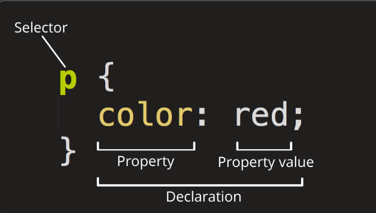

# Introduction to CSS

## What is CSS?

- Stands for Cascading Style Sheets.
- Used for adding style to web pages.
- If HTML is structure of a web page, then CSS is the presentation and appearance of the web page.

## Ways to apply CSS to a web page

### Inline CSS

```html
<p style="color: cyan">Hi, I am learning CSS!</p>
```

- This takes the highest precedence because it is directly applied to the element.

### Internal CSS

```html
<head>
  <style>
    p {
      color: green;
    }
  </style>
</head>
```

### External CSS

```html
<link rel="stylesheet" href="css/style.css" type="text/css" />
```

```css
/* style.css */
p {
  color: red;
}
```

- Here, `type="text/css"` in the `<link>` is for the old code. It is optional.
- CSS gets applied on the basis of precedence.
- Inline CSS has the highest precedence because it is directly applied on the element.
- This element is in the `<body>`, whereas the internal or external CSS will be present in the `<head>`.
- So initially when the page renders, internal or external CSS will be applied, but later when the flow comes to that particular element in the `<body>`, the inline CSS gets applied because it is directly applied on the element.
- This is how inline CSS has the highest precendence.
- Between internal and external CSS, precedence is based on how it is written.

```html
<!-- Case 1 -->
<link rel="stylesheet" href="css/style.css" />
<style>
  p {
    color: blue;
  }
</style>
```

- In this case, first the external CSS will be applied and later it will be overriden by internal CSS for same elements.

```html
<!-- Case 2 -->
<style>
  p {
    color: blue;
  }
</style>
<link rel="stylesheet" href="css/style.css" />
```

- Here, first internal CSS will be applied and then later the external CSS.
- Using external CSS is the best approach as it solves the problem of seperation of concern.

## Anatomy of CSS ruleset



## Validating CSS

- https://jigsaw.w3.org/css-validator/
